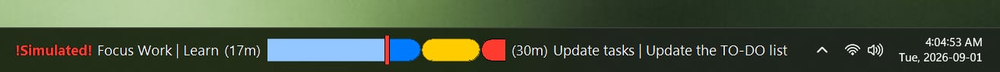
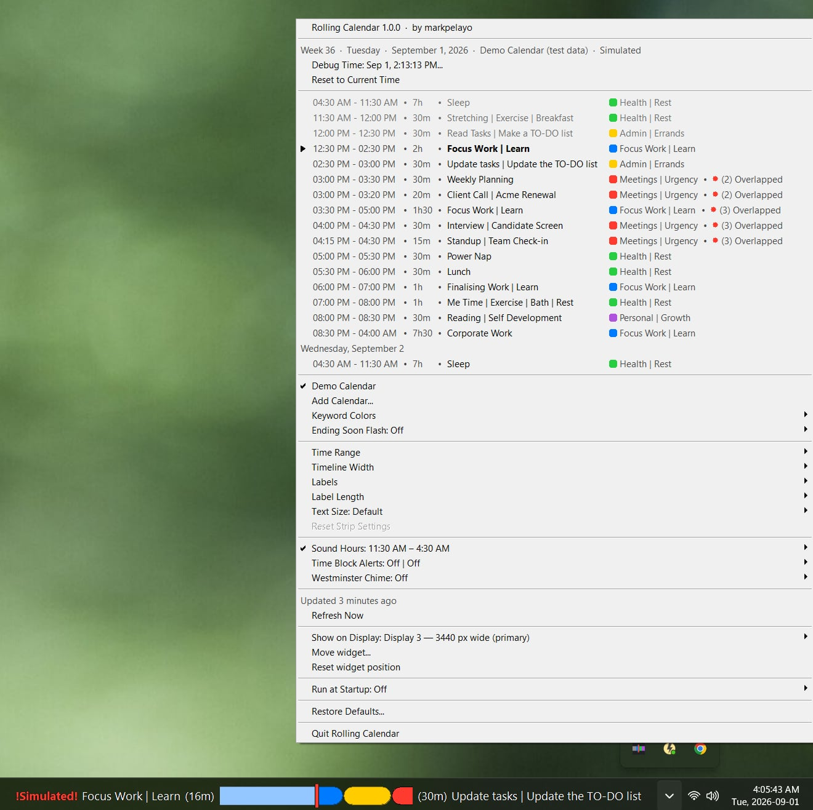

# Rolling Calendar for the Windows taskbar

[](https://github.com/markpelayo/windows-taskbar-RollingCalendar/actions/workflows/build.yml)
[](https://github.com/markpelayo/windows-taskbar-RollingCalendar)
[](LICENSE)

A small strip that lives inside the Windows taskbar and draws today's calendar as a horizontal timeline, scrolling right to left past a fixed red line marking now. It is a C++/Win32 port of [macos-menubar-RollingCalendar](https://github.com/markpelayo/macos-menubar-RollingCalendar), which does the same thing in the macOS menu bar. Events come from a public iCalendar feed you paste in, or from a built-in demo day. One executable, no installer, no third-party dependencies.

This is version 1.0.0. It runs on real hardware and has been used for real work, on one machine, on Windows 11 24H2. Please read [What has and has not been tested](#what-has-and-has-not-been-tested) before you decide how much to trust it.

---

## The UI



The widget sits in the taskbar immediately to the left of the clock and the notification icons. It is one row tall — a band roughly the height of a taskbar icon, so it sits alongside them rather than filling the bar — and somewhere between 250 and 700 pixels wide depending on how long your event names are.

Reading left to right in the screenshot above:

- **The left gutter.** Right-aligned text naming the block you are in and how long is left of it: `Focus Work | Learn (17m)`. In the last two minutes the whole label turns red and bold. The red `!Simulated!` marker in front of it is there because that shot was taken with Debug Time on; it does not appear in normal use, and it is red precisely so a strip showing a time that is not the time cannot be mistaken for one that is.
- **The strip.** A row of coloured capsules. No tick marks, no gridlines, no times written on the blocks. The elapsed part of the block in progress is drawn in a paler version of its own colour — the pale blue on the left of the shot — and a red vertical line sits at the exact centre.
- **The right gutter.** Left-aligned text naming what is next and how long that runs: `(30m) Update tasks | Update the TO-DO list`.

Either gutter can carry a small red dot with a number next to it. That is the overlap badge, and which gutter it is in matters — see [How it works](#how-it-works).

The strip's background is genuinely transparent, not an approximation of the taskbar's colour, so it reads as part of the bar under any wallpaper and with transparency effects on or off. How that is achieved is the subject of [How the taskbar part works](#how-the-taskbar-part-works-and-what-that-costs).

Left-click or right-click the strip and the same menu drops down:



It lists the day's blocks with their times, durations, categories and overlaps, and then every setting the app has. There is also an icon in the notification area, next to the clock, which opens the same menu; it exists so that there is always a documented, guaranteed way to reach the app even if the strip fails to appear.

---

## What it's for

The usual way to find out where you are in your day is to open a calendar, read a grid, find the row that contains the current time, and work out from that how much of the current block is left. That is four steps to answer a question you have perhaps thirty times a day.

Rolling Calendar removes the question. You glance at the taskbar and you can see it: how much of the current block has already gone pale behind the now line, how much colour is still ahead of it, whether the next thing starts in eight minutes or four hours, and whether anything is about to collide.

It is not a scheduling tool and it will not help you plan. It answers one question — *where am I* — and it answers it without being asked.

---

## How it works

**Time flows right to left.** The past is on the left, the future on the right, and everything drifts leftward at a constant rate. The now line does not move; the day moves past it.

**The now line is fixed at the centre of the strip.** This is the whole design. Because it never moves, your eye learns one position and stops searching. It is drawn as a four-pixel red bar with a one-pixel halo behind it in the opposite colour to the theme, because pure red disappears against a warm-toned capsule.

**The visible span is symmetrical around now.** By default an hour either side, so two hours of day fit in the strip. You can widen it to two hours either side or narrow it to five minutes, from the Time Range menu. A wider range shows more at a smaller size; at the defaults a fifteen-minute block is about 31 pixels wide, and at plus-or-minus fifteen minutes the same block is 125 pixels. The Timeline Width submenu tells you the current figure rather than making you work it out.

**Blocks fade as they elapse.** Each block is drawn twice: the whole capsule in its own colour, then the part to the left of the now line refilled in a paler version of that colour. So a block in progress visibly drains from the left. When it is entirely pale it is over.

**Overlaps are flagged, never stacked.** The strip is always one row. Where two blocks collide, the longer one is drawn first and the shorter one on top of it, so the short thing stays visible.

**Any block drawn on top of another gets a black ring.** Two concurrent blocks of the same colour — two meetings, say — would otherwise merge into a single capsule, and the badge in the gutter would tell you there was a clash without showing you where. Black is the one colour no calendar block uses, so it separates the pair at any size. Only the block on top is ringed; ringing both would draw a line down the middle of the pair and read as three blocks rather than two.

**The badge's side tells you *when* the clash is.** A badge in the right gutter means the clash is still ahead of you. As the clash reaches the now line the badge crosses to the left gutter, which means two things want you right this second. When it is over, it disappears. That is a more useful signal than a count on its own, and it costs nothing to read.

**All-day events are not drawn on the strip.** A block spanning the entire visible window would be a solid bar of colour behind everything else, telling you nothing. All-day events appear in the dropdown list and nowhere else, and they never trigger an alert. Zero-length events — reminders — are likewise not drawn, because a zero-width capsule is a stray sliver, but they do count towards the overlap badges and they do appear in the list.

**Which block gets to headline a gutter** is decided by time first: the left gutter takes whatever ends soonest, the right whatever starts soonest. Ties are broken by a chain score that favours events which butt up against their neighbours, on the theory that a back-to-back run of time blocks is the backbone of your day and a meeting dropped on top of it is not. Remaining ties go to the shorter block, then alphabetically, purely so the label cannot flicker between two equally good candidates once a second.

**The dropdown list runs anchor to anchor, not midnight to midnight.** The anchor is a keyword, `sleep` by default. The list starts at the last run of anchor events at or before now and ends at the next one, so a night shift reads as one continuous stretch instead of being cut in half at 00:00. If there are no anchors, or the day's anchor has not happened yet, it falls back to today plus a rolling twenty-four hours.

**Everything refreshes on a one-second timer.** That single tick redraws the strip, re-measures the widget, checks the alert schedule and checks the chime. The feed itself is re-read every five minutes, at launch, on wake from sleep, and whenever you change the calendar source.

---

## Download

Every push to `main` produces a build artifact, and every tagged release has `RollingCalendar-windows-x64.zip` attached. Inside is a single `RollingCalendar.exe` alongside the README, the licence and the disclaimer. There is nothing to install: unzip it somewhere permanent and run it.

If you would rather not wait for a tagged release, the artifact from the latest CI run on `main` is the same binary: open the [build workflow](https://github.com/markpelayo/windows-taskbar-RollingCalendar/actions/workflows/build.yml), pick the most recent green run and download `RollingCalendar-windows-x64` from the Artifacts section at the bottom. GitHub requires you to be signed in to download workflow artifacts, and it expires them after ninety days.

x64 only. The binary is statically linked, so it needs no Visual C++ redistributable. It is developed and used on Windows 11; see [What has and has not been tested](#what-has-and-has-not-been-tested) for what that does and does not imply about Windows 10.

### Build

The only prerequisite is MSVC and the Windows SDK. There is no vcpkg manifest, no NuGet restore, no submodules and no third-party libraries. Visual Studio 2022 Community or the standalone Build Tools both provide what is needed, as long as the **Desktop development with C++** workload is installed — that is the component that supplies both the compiler and the SDK.

Open **x64 Native Tools Command Prompt for VS 2022** from the Start menu. It has to be that prompt rather than an ordinary one; it is what puts `cl.exe`, `rc.exe` and the SDK headers on the path, and `build.bat` checks for it and says so if it is missing.

```
git clone https://github.com/markpelayo/windows-taskbar-RollingCalendar.git
cd windows-taskbar-RollingCalendar
build.bat
```

The result is `build\RollingCalendar.exe`, one static binary from one compiler invocation.

If you would rather use CMake — most editors and CI systems already know how to drive it — the `CMakeLists.txt` produces the same binary:

```
cmake -B build-cmake -S . -A x64
cmake --build build-cmake --config Release
```

Both paths are exercised in CI, because a build file nobody runs is a build file that has already broken.

### SmartScreen

The published executable is not code-signed, so the first time you run it Windows will show a blue box reading "Windows protected your PC" and offer only a **Don't run** button. Click **More info**, then **Run anyway**.

This is not a sign that anything is wrong with the file; it is what Windows says about every unsigned executable that has not yet been downloaded enough times to build a reputation. Making it stop requires a code-signing certificate, which costs several hundred pounds a year and has to be renewed. For a free single-developer utility that is not a sensible expense, so the prompt stays.

If you would rather not take an unsigned binary on faith, build it yourself. That is the whole reason the build is one batch file and no dependencies.

---

## Quick start

1. **Run `RollingCalendar.exe`.** A strip appears in the taskbar, to the left of the clock. If you cannot see it, look for the new icon in the notification area — clicking that opens the same menu, and [Troubleshooting](#troubleshooting) covers what to do next.
2. **Look at the demo day.** On first launch the app shows a built-in demo calendar: a realistic time-blocked day with deliberate collisions in the afternoon, so you can see what the overlap badges look like before you have any overlaps of your own. Nothing is being fetched from anywhere.
3. **Click the strip** to open the menu. Either button does it.
4. **Choose Add Calendar.** Give it a name and paste a link.
5. **Paste a Google Calendar embed link, a public `.ics` URL, a bare calendar address like `you@gmail.com`, or a `file://` path to a local `.ics` file.** The app works out the feed URL from any of those. See below.

The demo calendar stays in the menu, so you can switch back to it at any time.

---

## Getting a calendar link

The app reads one public iCalendar feed. It has no account, no sign-in and no API integration, so the feed has to be reachable by an anonymous HTTP GET.

**From Google Calendar:**

1. Open Google Calendar in a browser and go to **Settings**.
2. Under **Settings for my calendars**, pick the calendar you want.
3. Scroll to **Access permissions for events** and tick **Make available to public**. This is the part people miss, and without it nothing else will work.
4. Scroll further to **Integrate calendar**. Copy either the **Public address in iCal format** (a URL ending `.ics`) or the **Embed code** link (a URL containing `?src=`).

Both work. So does the bare calendar address on its own — if you paste `you@gmail.com` the app derives `https://calendar.google.com/calendar/ical/you%40gmail.com/public/basic.ics` for you. A `webcal://` link is rewritten to `https://`. Any other URL ending in `.ics` is used as-is, which is also the only way a local `file://` path survives: a local feed must end in `.ics`.

**About `ctz=`.** Google's embed links often carry a `ctz=` parameter naming a time zone, for instance `ctz=Europe/London`. If it is present, the app uses that as its display zone rather than the machine's. This is deliberate: a shared calendar published in another zone should read in the zone it was published in, not yours. If the parameter is absent, or names a zone the app cannot resolve, it falls back to the machine's own zone.

**The feed must be public.** Anyone who has the URL can read your calendar, which is precisely why the app can read it without asking you to sign in anywhere. If that is not an acceptable trade for a given calendar, do not publish it — make a separate calendar containing only what you are happy to expose, and point the app at that. If the feed is not public you will see `Calendar HTTP 404 — is the feed public?` on the strip, which is the most common cause by a wide margin.

---

## Keyword colours

iCalendar feeds carry no colour. There is no field for it and no convention worth following, so a calendar that looks colourful in Google arrives here as a list of titles and times. Colour therefore has to come from somewhere else, and the somewhere else is a set of keyword rules matched against the event title.

Each rule is a category, a colour and a keyword. Matching is **whole-word**: the title is lowercased, every non-alphanumeric character becomes a space, runs of spaces collapse, and the rule matches only if its keyword appears as a complete word. So `meal` matches "Prep the meal" but not "Oatmeal". This is worth the extra work — substring matching produces exactly the sort of wrong colour that makes you stop trusting the colours at all.

Where two rules could both match, **the longest phrase wins**. Rules are sorted by word count, then by length, then by the order they appeared in the file, and the first match is taken. Given `meal` in green and `meal prep` in purple: "Meal prep for the week" comes out purple, "Prep the meal" comes out green.

Anything that matches no rule is drawn in grey and listed under `Uncategorized`.

**The built-in sample** is 42 rules across 6 categories — Focus Work | Learn (blue), Meetings | Urgency (red), Health | Rest (green), Admin | Errands (yellow), Personal | Growth (purple), Travel | Buffers (teal). It is seeded once on first launch and guarded by a flag, so if you clear it, it stays cleared. **Save Sample CSV** writes it out as a file you can edit.

**CSV import** takes three columns: category, colour, keyword. The colour may be a hex value or one of seventeen names (`red`, `orange`, `yellow`, `green`, `mint`, `teal`, `cyan`, `blue`, `indigo`, `purple`, `pink`, `brown`, `grey`, `light grey`, `dark grey`, `black`, `white`). The importer is deliberately forgiving, because people export these from spreadsheets and a file that fails on a semicolon helps nobody: it strips a byte-order mark, normalises line endings, auto-detects whether the delimiter is a comma, semicolon or tab, handles quoted fields with doubled quotes inside them, identifies columns by header name, and — if there is no header row at all — infers which column is which by inspecting the first twenty rows. When it does fail, the error includes what delimiter it detected, which column it took for what, and the first data row, so you can see what it thought it was reading.

After an import it tells you how many rules it took, how many rows it skipped, which colour strings it did not recognise, and which duplicate keywords it kept once.

Changing the rules recolours the events immediately. It does not refetch, because nothing about the feed has changed.

---

## Menu reference

The menu is the entire user interface. There are no windows, no preferences dialog and no settings page — everything the app can do is one click away from the strip. It is rebuilt from scratch each time it opens, so it always shows the truth.

The order below is the order the menu is built in, top to bottom, with the separators where the menu puts them. The grouping is the same as the macOS original's: what the blocks *are* above the separator, what the timeline *looks like* below it.

| Item | What it does |
|---|---|
| `Rolling Calendar 1.0.0 · by markpelayo` | Opens the project page in your browser. |
| `Week 36 · Tuesday · September 1, 2026 · <source>` | Caption, not clickable. ISO 8601 week number, the date in the display zone, and the name of the calendar being read. Gains `· Simulated` when Debug Time is on. |
| `Debug Time…` | Opens a date and time picker. Picking a time shifts the app's clock by an offset — it keeps running, so blocks still slide and countdowns still tick. Useful for seeing what the strip does at 4am without staying up. The title shows the simulated time while active. |
| `Reset to Current Time` | Only present while simulating. Clears the offset. |
| *the day's blocks* | Up to 60 rows: a marker and bold title for the block you are in, then start and end times, duration, title, a category swatch and name, and an `(N) Overlapped` badge where one applies. Date separators appear where the day changes. Beyond 60 rows a final row reads `… and N more`. Not clickable — this is a listing, not a set of commands. |
| — | |
| `Demo Calendar` | Switches to the built-in demo day. Ticked when active. |
| `Add Calendar…` | Two fields, name and link. Shown only while no calendars are saved. |
| `Saved Calendars ▸` | Replaces the row above once anything is saved. One row per calendar; clicking one activates it, and the tick marks the one being read. Each has an `Edit "name" ▸` submenu with **Rename** and **Remove**. Ends with `Add Calendar…`. |
| `Keyword Colors ▸` | Shows how many rules are loaded and where they came from, one dim row per category with its swatch and rule count, plus `Uncategorized`. Then **Import CSV…** (reading **Import Another CSV…** when rules already exist), **Use Sample Colors**, **Save Sample CSV…** and, when rules exist, **Clear Keyword Colors**. |
| `Ending Soon Flash: <state> ▸` | **Off** (the default), then one, two or five minutes before the end, plus **Add Custom…** for anything from a quarter of a minute to sixty. A custom value that is not a preset gets its own ticked row, so the setting in force is never invisible. See below. |
| — | |
| `Time Range ▸` | The visible span: ±5, ±10, ±15, ±30 minutes, ±1 hour (default), ±2 hours. |
| `Timeline Width ▸` | 100 to 450 points in steps of 50, the smallest and largest labelled as such. The note underneath tells you how wide a fifteen-minute block currently is. |
| `Labels ▸` | Four toggles: left gutter block name and time left, right gutter block name and how long it runs. Overlap warnings always show and cannot be turned off. |
| `Label Length ▸` | 100 to 480 points, each labelled with roughly how many characters that is — measured at runtime in the actual font, not hard-coded. Long names are shortened with an ellipsis; the countdown and the overlap badge are never cut. |
| `Text Size: <state> ▸` | **Default (matches the taskbar)**, which is the shell's own menu-font size and what everything else in the bar draws with, then 11, 13 and 15 pt, then **Add Custom…** for 6 to 48 pt. A custom size is remembered so it can be chosen again without retyping, and each remembered size has a **Remove** row beneath it — a list you can add to but not take from fills up permanently. |
| `Reset Strip Settings` | Resets the nine geometry settings above: time range, timeline width, the four label toggles, label length, text size and the remembered custom sizes. Nothing else. Greyed out when they are all already at their defaults. Renamed from "Restore Strip Settings", because two rows in one menu both beginning "Restore" read as the same action twice and the heavier of the two is further down. |
| — | |
| `Sound Hours: <windows> ▸` | The one schedule both sound features consult. **Off**, the two presets (11:30 AM – 4:30 AM and 6:00 AM – 11:00 PM), any custom windows you have added with a `Remove` row each, **All day**, and **Add Custom…**. Several windows may be ticked at once. |
| `Time Block Alerts: <leads> \| <output> ▸` | See [Sounds](#sounds). Contains **Alert Me** (the lead-time set), **Alert Sound**, **Voice**, **Categories** and **Test Alert Now**. |
| `Westminster Chime: <mode> ▸` | **Off**, **On the hour**, **Every quarter hour**; then **Strike the Hour Count**, **Volume**, a **Hear It** submenu with all four quarters, and **Stop Ringing** which is enabled only while it is actually ringing. |
| — | |
| `Updated just now` | Caption, not clickable. How old the data is, measured on the real clock rather than the simulated one. Reads `Refreshing…` in flight and `Not read yet` before the first fetch. |
| `Refresh Now` | Re-downloads the feed, bypassing the local cache. Greys out and reads `Refreshing…` while a request is in flight. |
| — | |
| `Show on Display: <label> ▸` | Which display's taskbar hosts the strip. **Primary display (automatic)**, then one row per taskbar, labelled like `Display 3 — 3440 px wide (primary)`. **This row is only present when the shell has more than one taskbar**; on a single-monitor machine, or one where the taskbar is shown on the primary display only, a menu offering a choice of one would be a puzzle rather than a setting. Windows only creates a taskbar on a secondary display when "Show my taskbar on all displays" is on, so this is a list of taskbars, not of monitors, and the note at the bottom of the submenu says so. |
| `Move widget…` | Arms drag-to-reposition: the next drag on the strip slides it along the taskbar. The position is remembered as a distance from the taskbar's right edge. |
| `Reset widget position` | Forgets that, and puts the strip back to automatic placement immediately left of the notification area. |
| — | |
| `Run at Startup: <state> ▸` | **Off**, **On**, and a delay of 5, 10, 15, 20, 30 or 60 seconds. See [Run at startup](#run-at-startup). |
| — | |
| `Restore Defaults…` | Deletes every setting, including the ones `Reset Strip Settings` deliberately leaves alone. The confirmation lists exactly what will go and **Cancel** is the default button, because Return should not be the fast path to a wipe. Greyed out when everything is already at its default. |
| — | |
| `Quit Rolling Calendar` | Exits. |

Two suffixes appear on menu titles when they apply: `· quiet now` on the two sound features whenever Sound Hours currently forbids sound, and `· Simulated` on the caption while Debug Time is active.

### Ending Soon Flash

Ported from the macOS version 1.6.3. For the last N minutes of the block you are in, its name in the left gutter blinks red, alternating on and off once a second. The weight of the label changes once, at the start of the window, rather than with the blink, so the label cannot jitter or resize as it flashes.

It is off by default. Presets are one, two and five minutes; ten was offered briefly in the original and dropped, because a name blinking for ten minutes stops being a warning and becomes the strip's normal appearance. A custom value takes anything from 0.25 to 60 minutes.

**Reset Strip Settings deliberately does not clear it.** Only Restore Defaults does. Everything else in that block below the separator is geometry — how wide the strip is, how long the labels may be — and a click aimed at the timeline's proportions should not silently switch off the thing telling you a meeting is about to end. This is the one place where the two reset commands differ on purpose.

---

## Settings

Everything lives in one INI file:

```
%APPDATA%\RollingCalendar\settings.ini
```

It is read once at launch, held in memory and written through on change, so a redraw never touches the disk. You can edit it by hand with the app closed. Anything unreadable falls back to the default rather than being an error.

**Restore Defaults deletes the whole file** rather than a list of keys. This is deliberate. Every implementation that enumerates known keys and deletes them has the same bug: a setting introduced in a later version cannot be cleared by an older reset path, and the "restored" app is not actually at defaults. Deleting the file cannot get that wrong.

### On the menu

These have menu items, and the file is just where they are kept.

| Section | Key | Default | What it is |
|---|---|---|---|
| `[strip]` | `windowMinutes` | `120` | Total visible span in minutes, centred on now. Time Range. |
| `[strip]` | `timelineWidth` | `250` | Width of the capsule area in logical pixels. Clamped to 50–900 on read. |
| `[strip]` | `maxLabelWidth` | `360` | Longest a gutter label may get, in logical pixels. |
| `[strip]` | `showNowName`, `showNowTimeLeft`, `showNextName`, `showNextDuration` | `true` | The four Labels toggles. |
| `[strip]` | `endingFlashSeconds` | `0` | Ending Soon Flash window, in seconds. `0` is off. |
| `[strip]` | `titleFontSize` | `0` | Gutter text size in points. `0` means the shell's own menu-font size. **Moved here from the hidden section in 1.0.0**, because it is now the Text Size menu and resets with the rest of the strip's appearance. |
| `[fontsize]` | `count`, `custom1`… | none | The custom text sizes you have added and not removed. |
| `[widget]` | `offsetFromRight` | `-1` | Where the strip sits, as a distance in pixels from the taskbar's right edge. `-1` means automatic placement left of the notification area. Set by Move widget, cleared by Reset widget position. |
| `[widget]` | `monitorDevice` | empty | Which display's taskbar hosts the strip, as an adapter device name such as `\\.\DISPLAY2`. Empty means the primary. A name rather than an index, because indices are reassigned when a display is unplugged and a stored preference that quietly comes to mean a different screen after a dock is worse than one that fails to apply. Kept even when that display is absent, so unplugging a dock does not silently forget the choice. |

The remaining sections — `[calendar]`, `[keywords]`, `[debug]`, `[soundhours]`, `[alerts]`, `[chime]`, `[startup]` — hold your saved calendars, your keyword rules, the Debug Time offset and the sound and startup settings, all of which are entirely driven from the menu and are not worth tabulating here.

### Hidden settings

No menu item. They exist because they are worth having but not worth a menu row, and because the alternative to a one-line edit in an INI file, for the failures some of them work around, is a rebuild. All of them live under `[hidden]`.

| Key | Default | What it is |
|---|---|---|
| `nowLineWidth` | `4` | Thickness of the red now line, in logical pixels. |
| `urgentSeconds` | `120` | How long before a block ends the left gutter turns red and bold. Distinct from Ending Soon Flash: this changes colour and weight once, the flash blinks. |
| `unmatchedColor` | `#8E8E93` | Colour for events that match no keyword rule. |
| `solidBlocks` | `true` | `false` draws translucent tinted blocks instead of solid ones. GDI cannot fill a rounded rectangle through an alpha channel, so the translucent style is a blend against the background rather than true transparency; it is exact wherever what lies underneath is the background, which on the strip it almost always is. |
| `blockGap` | `1` | Cosmetic gap between adjacent blocks, in logical pixels. Never alters the time span a block represents. |
| `blockCornerRadius` | `0` | `0` means a full capsule, that is, a radius equal to half the height. |
| `dayAnchorKeyword` | `sleep` | What opens and closes the dropdown's day. |
| `hostOverride` | `0` | How the strip is hosted, for when the automatic choice is wrong on a particular machine. `0` auto, `1` plain child of the taskbar, `2` layered child, `3` floating window over the taskbar. Auto means a layered child, falling back to floating if layering fails. Try `1` if the strip is visible but misbehaves, and `3` if it cannot be seen at all. See [How the taskbar part works](#how-the-taskbar-part-works-and-what-that-costs). |
| `diagnosticLog` | `false` | `1` writes `RollingCalendar-log.txt` beside the executable — or in `%APPDATA%\RollingCalendar` when that folder is not writable, which is the normal case for anything unpacked into Program Files. It describes the taskbar, the strip's window state and the shell's child z-order: everything at startup, a heartbeat every ten seconds, and a full snapshot each time the menu opens, so you have a way to mark the moment something looked wrong. A couple of kilobytes a minute, truncated on every launch. This is the one thing worth turning on before reporting that the strip does not appear. |
| `pastFade` | `0` | How far the elapsed part of a block is blended toward white. `0` means the built-in value, which differs between the light and dark themes. Tunable because how much fading reads as "past" depends entirely on what the wallpaper behind the taskbar looks like. |
| `blockHeight` | `0` | Height of the capsule band in logical pixels. `0` means the built-in 24, chosen to match a taskbar icon so the strip sits alongside them rather than filling the bar. Worth changing on a taskbar that has been made larger or smaller than the default. |
| `innerGap` | `0` | Logical pixels between a gutter and the timeline. `0` means the built-in 6. |

Numbers here are read as "zero or missing means the default", so a value must be greater than zero to take effect. `blockCornerRadius` is the exception, since zero is a meaningful choice there.

---

## Sounds

Two independent features, both gated by one schedule.

### Sound Hours

A set of time windows during which the app is permitted to make a noise. It is a set, not a single choice — several windows can be ticked at once. Both endpoints are inclusive, so a window labelled 6:00 AM – 11:00 PM does ring the 23:00 strike. A window whose end is not after its start wraps past midnight, which is how the default 11:30 AM – 4:30 AM works. `All day` is an explicit choice, distinct from having nothing set.

Emptying the list is the same thing as switching it off. When it is off, every row reads as unticked, so a click means "turn this on" rather than "delete this"; the `Remove` rows are the permanent delete, and only a window you added has one.

When you switch on a sound feature and Sound Hours has never been touched, the default window is opened for you. Being silenced by a schedule you never set would look like a bug rather than a setting. A deliberate later "off" is respected.

### Time Block Alerts

Tells you a block is about to start, by playing a sound or by speaking.

**Lead times are a set, not a choice.** Ten minutes before and one minute before are both useful and they are not alternatives — the first lets you finish what you are doing, the second gets you into the room. Presets are *when it starts*, one minute, five minutes and ten minutes before, plus a custom value from a quarter of a minute to two hours. Zero is legitimate.

**The lateness rule.** An alert that is more than thirty seconds late is marked as fired and then silently skipped. This is the single most important rule in the feature. If your machine was asleep, or the app has only just launched, then announcing "ten minutes before Focus Work" when there are three minutes left is not a late alert, it is a wrong one — it tells you something false about your own day, and one of those is enough to make you stop believing the next twenty. Silence is the correct output.

Sound and speech are mutually exclusive; choosing one turns the other off, because two things talking over each other is not twice as useful. Sounds come from the `.wav` files already in `%WINDIR%\Media`, plus anything you import, which is copied into `%APPDATA%\RollingCalendar\Sounds`. Speech uses the SAPI voices installed on the machine; if there are none the menu says so, and **Manage Voices…** opens the Windows speech settings page where more can be added.

Spoken alerts announce the part of the title before the first `|`, because a vertical bar reads aloud as an awkward pause. Several blocks starting together are announced in one sentence — "A", "A and B", "A, B and C", no Oxford comma.

A category filter is available. An empty set means every category and is stored that way, so a category you add later is included rather than silently excluded. The first click on a category gives you "everything but this", which is what people mean the first time.

All-day events never trigger an alert. **Test Alert Now** fires immediately and ignores Sound Hours, which is the only sensible behaviour for a button with that label.

### Westminster Chime

The Westminster Quarters, on the hour or every quarter hour, optionally followed by the hour struck on a twelve-hour count.

**It is synthesised, not recorded.** Nothing is bundled and nothing is downloaded. The reason is copyright: a recording of Big Ben belongs to whoever made it, whereas the tune, written in 1793, belongs to nobody. So the app builds the audio from sine partials each time it rings. A few kilobytes of code instead of a few megabytes of samples, and it can be re-pitched, re-timed and volume-adjusted without a sample library.

The bell timbre is inharmonic on purpose. The hum partial at half the fundamental and the tierce at 1.19 are what make a bell sound like a bell rather than an organ, and the tierce being a minor third is why bells always sound faintly mournful.

Volume presets are 25, 50, 75 and 100 per cent, plus custom values from 1 to 100. Zero is not offered: silence is what **Off** and Sound Hours are for.

The quarter that has been rung is recorded by absolute index — the number of 900-second periods since the epoch — rather than by wall-clock time, so the repeated hour at a daylight-saving fall-back is not silenced. The index is stamped before the five-second freshness check, which means a tick that arrives late consumes that quarter permanently: waking a machine at twenty past must not ring the quarter it slept through.

---

## Run at startup

The app registers a **Task Scheduler** entry with an *at log on* trigger, not an `HKCU\...\Run` value.

The reason is the delay. A Run entry cannot express one, and the delay is the entire point. Signing in is the busiest moment your disk and network will have all day — Explorer, OneDrive, Teams, antivirus and everything else you have ever installed are all starting at once — and a calendar widget has no business competing for that. Task Scheduler's built-in "Delay task for:" defers the *launch itself*, which is strictly better than the best a Run entry could manage, namely launching on time and then sleeping.

It also means the entry is visible in Task Scheduler under the name `RollingCalendar`, where you can see it and remove it without going anywhere near the registry. No shell wrapper, no administrator rights.

If the registered path no longer matches the running executable — you moved the folder — the entry is rewritten on the next launch rather than left dangling. If machine policy forbids registering a task, the menu says so rather than silently failing.

---

## How the taskbar part works, and what that costs

This is the one genuinely unsupported thing the app does, and getting it right took longer than anything else in the project, so it deserves a plain explanation rather than a footnote.

On macOS this app is an `NSStatusItem`: a documented slot in the menu bar, of whatever width you ask for, that can host an arbitrary custom view. That is exactly what a scrolling timeline with two text gutters needs, and Windows has nothing like it.

The options Windows does offer, and why none of them work:

- **A notification-area icon** is a fixed square, 16×16 at 100% scaling, and cannot show text. Using it would lose the timeline and both gutters — that is, the entire application.
- **Deskbands**, the old COM mechanism for real taskbar toolbars, were deprecated in Windows 8 and their user interface was removed outright in Windows 11. Building on them now would mean building on something already gone.
- **A floating always-on-top window** works, but it is a window sitting *over* the taskbar rather than in it. It does not move when the taskbar moves, does not hide when the taskbar auto-hides, and looks like what it is.

What is left, and what the app does, is to create an ordinary child window and re-parent it into the taskbar's own window — the one whose class name is `Shell_TrayWnd` — using `SetParent`. The child then moves, hides and auto-hides along with the taskbar, because as far as the shell is concerned it is part of it. `SetParent` returns the previous parent, and null means both "it failed" and "it had no parent", so the result is confirmed by asking `GetParent` rather than by trusting the return value.

### On Windows 11, that is not enough

Re-parenting alone puts the window in the taskbar and leaves it invisible.

Windows 11 renders its whole taskbar through a composition island: a child window of class `Windows.UI.Composition.DesktopWindowContentBridge` spanning the entire bar. DWM draws a composited visual *above* the GDI painting of sibling windows regardless of the legacy child z-order. So the strip sat at the very front of the taskbar's children, reported itself visible, correctly sized and correctly positioned by every measure the app could take, and could not be seen. Winning the child-order fight and then losing to the compositor looks, from the outside, exactly like the widget not running at all.

Nothing the app could ask about its own window would have found that, which is why [`diag.h`](src/diag.h) exists and why `diagnosticLog` is still shipped. It took a log of the shell's child z-order, with our window marked, to establish that the sibling order was not the problem.

**The fix is to make the strip a layered child** — `WS_EX_LAYERED`, with `SetLayeredWindowAttributes`. DWM then redirects the window into a composition visual of its own, which lands above the shell's island. The alpha is not an effect; it is the mechanism for getting redirected into the compositor at all, and the window stays fully opaque.

`WS_EX_LAYERED` on a *child* window has been supported since Windows 8. A great many references, including an earlier comment in this project's own source, still say it is impossible or applies to top-level windows only. That was the wrong assumption, and it cost a day. If you are reading this because you are trying to do something similar: it works, and it has worked for over a decade.

Being layered has a second benefit that turned out to matter as much as the first. Setting a colour key gives the strip real transparency: the paint code fills its background with exactly the key colour and that colour vanishes, so what shows through is the taskbar itself. The alternative — guessing the taskbar's colour and painting a matching slab — was never going to work, because with transparency effects on, the bar is acrylic over the user's wallpaper and there is no single colour to guess. The key colour is defined in one place, `timeline::ChromaKey()`, and both the window setup and the paint code read it from there; if the two ever disagreed the result would be an opaque slab with nothing in either file looking wrong, which is the kind of bug that takes a day.

`hostOverride` in the settings file forces the choice: `1` for a plain child, `2` for a layered child, `3` for floating. Auto is a layered child.

### What it costs

Everything above is built out of documented calls — `FindWindow`, `SetParent`, `SetWindowPos`, `SetWindowLongPtr`, `SetLayeredWindowAttributes`. What is not documented, and what Microsoft has never committed to, is that the taskbar will tolerate a foreign child window living inside it. That is emergent shell behaviour. It happens to work; nobody has promised it will keep working.

The consequences, stated plainly:

- **A future Windows update could break it.** Not "might behave oddly" — could stop it working entirely. There is no contract here to appeal to. It has already changed once, between Windows 10-style taskbar painting and the Windows 11 composition island, and that change was invisible until it was investigated.
- **Explorer restarts detach it.** When Explorer crashes or is restarted, the old taskbar window is destroyed and this window is left parentless. The shell broadcasts a `TaskbarCreated` message to every top-level window when the new one is ready, and the app listens for it, re-queries the taskbar, re-embeds itself and re-adds its notification icon. This is handled, and it is handled using the documented mechanism intended for exactly this situation.
- **The taskbar does not announce that it has moved.** There is no notification when the bar is dragged to another edge, when auto-hide is toggled, when the DPI changes or when a monitor arrangement shifts. So the app re-checks the taskbar's position, edge and DPI on its own timer rather than waiting to be told. The edge is inferred from geometry rather than asked for, because `SHAppBarMessage(ABM_GETTASKBARPOS)` reports the primary taskbar only and the shell has never had an API for "which side is this particular bar on".
- **A child inserted by `SetParent` lands at the back of the z-order**, and the shell reorders its children whenever it relayouts. So the strip re-asserts its place at the front on every move and again on the periodic poll, rather than once at embedding time.
- **The widget anchors to the notification area**, sitting immediately to its left. Not the far left, and not next to the app buttons — on Windows 11 the app buttons are centred and move as windows open and close, so a widget anchored to them would slide around all day. The far left is where the weather and news widget lives. The notification area is the only part of the taskbar that stays where it is. If you would rather it sat somewhere else, **Move widget…** lets you drag it, and the position is remembered as an offset from the right-hand edge.
- **It looks for another application's widget before parking.** Two apps using this technique would otherwise both claim the same spot and one would silently cover the other, so the automatic placement finds the rightmost gap before the tray that is not already occupied. When there is no clear gap it parks beside the tray and overlaps deliberately — that is at least where you would look for it — and says so in the diagnostic log, because from the outside a deliberate overlap and a placement bug look identical.
- **Every failure path falls back to floating.** If the taskbar window cannot be found, if `SetParent` fails, if `SetLayeredWindowAttributes` fails, if the machine is locked down or the shell has been replaced, the app puts up an always-on-top window positioned over the taskbar instead. Less integrated, and it will not hide when the taskbar hides, but it is never invisible. When it is floating rather than layered, the background is painted as an approximation of the taskbar's colour, because the key colour would otherwise render as a near-black slab.
- **The notification-area icon is the escape hatch.** An icon in the notification area is a documented, guaranteed way to reach the menu when none of the above has worked.

This technique is shared with the author's [windows-taskbar-pinger](https://github.com/markpelayo/windows-taskbar-pinger), which established that it works and what it costs. The two run side by side in the same taskbar on the development machine, which is also how the gap-finding above came to be written.

If any of this is not an acceptable foundation for you, that is a reasonable conclusion, and it is why the section exists.

---

## Resource usage

The app is meant to be indistinguishable from idle, and the design choices that make it so are worth listing because they are the reason it can afford to redraw once a second.

- **No child processes.** Nothing is shelled out to, ever. No PowerShell, no `curl`, no helper executable.
- **Nothing is allocated per repaint.** A Windows process is capped at 10,000 GDI handles. Leaking a single brush per redraw, at one redraw per second, would exhaust that in under three hours and kill the app. Every brush, pen, font, bitmap and region in the codebase is owned by an RAII wrapper, and the fonts and colours used by the strip and the menu rows are created once and cached against the current DPI rather than rebuilt per frame.
- **No iostreams.** Pulling in `<iostream>` adds a static initialiser and a meaningful chunk of binary to a program that has no console and never prints anything.
- **One timer.** A single one-second tick redraws the strip, re-measures the widget, checks the alerts and checks the chime. Nothing else is scheduled. The feed is fetched every five minutes on that same tick.
- **Settings are cached in memory** and written through on change, so a redraw never touches the disk.
- **The gutter labels are cached** against the integer second, the events generation, the theme and a fingerprint of exactly the settings a label reads. They are needed twice per tick — once to size the widget, once to paint it — and composing them twice would be twice the work for the same answer.
- **Resizes are hysteretic.** The widget is only resized when the wanted width differs from the current one by more than a pixel. A resize forces the taskbar to lay out everything inside it, so a widget that oscillated by one pixel would make the whole bar twitch once a second.
- **Non-recurring events are filtered to the four loaded days as they are parsed**, so a calendar with ten years of history costs no more to refresh than one with a week in it.
- **The diagnostic log is off unless you turn it on**, so nobody pays for it who is not debugging.

---

## Differences from the macOS version

The port is faithful in behaviour. Where it differs, the platform forced it.

| | macOS | Windows |
|---|---|---|
| The strip | `NSStatusItem` with a custom view of any width | A layered child window re-parented into `Shell_TrayWnd`, with a floating fallback. There is no supported equivalent; see above. |
| Background | The menu bar composites the view for you | A colour key on a layered window. Same result, reached by a different and undocumented route. |
| Menu rows with inline buttons | Saved-calendar rows carried a pencil and a cross drawn inside the row | An `HMENU` item cannot hold buttons, so each saved calendar has a nested `Edit "name" ▸` submenu containing **Rename** and **Remove**. More clicks, but it behaves correctly under every theme, high-contrast setting and screen reader without any help from the app. |
| Overlap badge | A red circle emoji followed by the count | A drawn red dot followed by the count. Emoji rendering in an `HMENU` and in taskbar text is inconsistent across Windows versions and fonts; a filled ellipse is not. |
| Speech | `AVSpeechSynthesizer` | SAPI 5. Different voices, same behaviour: offline, no permission prompt, and a pointer to the system settings page for installing more. |
| Chime playback | `AVAudioEngine` with a submitted PCM buffer | `waveOut`, with the same synthesised buffer. Device changes tear down and rebuild the output either way. |
| Run at startup | A LaunchAgent plist wrapping `sleep N; exec` | A Task Scheduler logon task with a built-in delay. This is the better mechanism of the two — the delay is native rather than a shell wrapper. |
| Multi-monitor | One menu bar per display, handled by the system | `Show on Display`, which is a list of taskbars rather than of monitors, since Windows only puts a taskbar on a secondary display when asked to. |
| Time zones | IANA identifiers understood natively | Windows names zones its own way and there is no API that translates. The port carries a CLDR-derived mapping table covering the zones a shared calendar is realistically going to name. A miss is not an error: it falls back to the machine's zone, because a strip that is an hour out still tells you when your next meeting is, and a strip that failed to load tells you nothing. |
| Menu rows | Four custom `NSView` subclasses | Three kinds of owner-drawn row — day blocks, captions and keyword categories — because `HMENU` text has neither tab stops nor inline colour swatches, and those three need both. Everything else is ordinary menu text. |
| Dark mode | `effectiveAppearance` | The `AppsUseLightTheme` preference, plus `WM_SETTINGCHANGE` on `ImmersiveColorSet`. Taskbar text colour is read from the *system* theme preference rather than `GetSysColor(COLOR_BTNTEXT)`, which reports the apps theme and is black under a default Windows 11 setup while the taskbar beside us is drawing white. |
| Distribution | No binary, because notarisation costs $99 a year | A binary is published, because Windows lets you run unsigned executables — it just complains first. |

---

## What has and has not been tested

**Verified working** on Windows 11 24H2, build 26100, on one machine: at 3440x1440 and at 1920x1080, on a bottom-docked taskbar at 100% scaling, in both the light and dark system themes, and alongside the author's [windows-taskbar-pinger](https://github.com/markpelayo/windows-taskbar-pinger) embedded in the same taskbar. The strip embeds, draws, positions itself, survives an Explorer restart and reads a real Google Calendar feed.

**Untested**, in roughly descending order of how likely it is to be wrong:

- **Windows 10, of any build.** Not once. The layered-child technique should not need the composition island to be present, and the code chooses a layered child regardless of shell version, but "should" is the operative word and nobody has looked.
- **Fractional display scaling** — 125%, 150%, 175%. The strip measures the taskbar and scales against its DPI, which is exactly the sort of arithmetic that is wrong by one pixel in a way you only see on a real machine.
- **Taskbars docked to the left or right edge.** The code handles the vertical case throughout and has never run in it. Windows 11 does not offer the option at all, so this only arises on Windows 10, which is also untested.
- **Auto-hide taskbars.**
- **More than one taskbar.** `Show on Display` has been exercised on a multi-monitor machine with the taskbar on the primary display only, which is not the same as having a bar on each.
- **ARM64.** No build is published.

And one thing that is not a testing gap but a structural risk: **the taskbar embedding relies on undocumented shell behaviour that Microsoft has never committed to.** See the section above.

If you run it in any of the untested configurations, a report either way is the most useful thing you could send, and `diagnosticLog=1` is what makes such a report actionable.

---

## Limitations

Inherited from the design, and true of both versions:

1. **The iCalendar parser handles a practical subset of RFC 5545.** `FREQ=DAILY|WEEKLY|MONTHLY|YEARLY` with `INTERVAL`, `BYDAY`, `BYMONTHDAY`, `UNTIL` and `COUNT`, plus `EXDATE` and `RECURRENCE-ID` overrides. `COUNT` truncation is approximate for weekly rules with several `BYDAY` values. There is no `BYSETPOS`, `BYWEEKNO`, `BYYEARDAY` or `WKST`, no `VTIMEZONE` definitions, and attendees, organisers, locations, descriptions and attachments are all ignored. Anything unsupported yields no occurrences rather than a wrong one.
2. **Recurrence is expanded only for the four loaded days** — yesterday through the day after tomorrow. Anything outside that window does not exist to the app.
3. **All-day events appear in the dropdown but not on the strip**, and never fire alerts.
4. **Feeds carry no colour**, so blocks are coloured by keyword rules or shown as uncategorized grey.
5. **Google's feed cache** means an edit in Google Calendar can take minutes, occasionally hours, to reach the app. **Refresh Now** guarantees only that the app re-downloads and bypasses the local cache. It cannot make Google republish.
6. **One day only.** No multi-day view, no scrolling back, no zooming by drag.
7. **One calendar at a time.** Saved calendars are named profiles you switch between; they are not merged.
8. **A failed refresh keeps the last good day for thirty minutes**, then clears it. Until then the strip shows the error with the last known plan underneath, because showing a stale day beats showing nothing. After thirty minutes it really is unknown.
9. **Read-only.** Nothing is ever written back to a calendar.
10. **Overlap label ownership is heuristic.** Telling "my own time block" from "a meeting someone sent me" would need organiser and attendee data, which the feed path does not provide.
11. **Demo blocks are built as midnight plus a number of minutes**, so their wall-clock times shift across a daylight-saving boundary.

Specific to this port:

12. **There is no Outlook, Microsoft Graph or Windows Calendar integration.** None. The app reads a public `.ics` feed over HTTP or from a local file, and nothing else. There is no account, no sign-in, no OAuth and no connector. If your calendar cannot be published as a public feed, this app cannot read it.
13. **The taskbar embedding is undocumented shell behaviour.** Microsoft has never committed to it.
14. **MSVC only.** MinGW may work but the manifest and resource handling differ, and it is not tested.
15. **x64 only.**

---

## Troubleshooting

**Nothing appeared.** Look near the clock rather than in the middle of the taskbar — the strip anchors to the notification area, not to the app buttons. If it genuinely is not there, look for the Rolling Calendar icon in the notification area, which is added regardless of whether the strip embedded successfully; clicking it opens the same menu, and its tooltip carries the same text the gutters do.

If the icon is there and the strip is not, work through this in order:

1. Set `diagnosticLog=1` under `[hidden]` in `%APPDATA%\RollingCalendar\settings.ini`, with the app closed, and start it again. `RollingCalendar-log.txt` appears beside the executable, or in `%APPDATA%\RollingCalendar` if that folder is read-only. It records whether the taskbar was found, whether `SetParent` succeeded, whether layering succeeded, where the strip was placed and where it sits in the shell's child order.
2. Set `hostOverride=3`. That forces a floating window over the taskbar, which is the mode with the fewest ways to fail. If the strip appears there, the embedding is the problem and the log will say which step failed.
3. Set `hostOverride=1` for a plain, unlayered child. On a Windows 11 taskbar this will most likely be invisible for the reasons described above, but it is the right thing to try on a machine where layering itself misbehaves.
4. Send the log. A machine where this fails is more useful to the project than a machine where it works.

**It is on the wrong monitor.** Open the menu and use **Show on Display**. If the display you want is not listed, Windows has not put a taskbar on it: turn on "Show my taskbar on all displays" in Windows' own taskbar settings first. The submenu lists taskbars, not monitors, and it only appears at all when there is more than one to choose between.

**It is sitting on top of another taskbar widget.** The automatic placement looks for a clear gap to the left of the notification area and only overlaps when there is none — usually because the bar is crowded or the strip is unusually wide. Narrow it with **Timeline Width** or **Label Length**, or use **Move widget…** to drag it somewhere with room and **Reset widget position** to undo that. With `diagnosticLog=1` on, the log states outright when it has overlapped deliberately.

**Everything is grey.** Grey is the colour for "matched no keyword rule". Either the rules have been cleared, or none of them match your event titles. Open **Keyword Colors** and see what it says — if it reads `No keyword colors`, choose **Use Sample Colors**. If rules are loaded but nothing matches, your titles do not contain the sample's keywords, which is entirely likely if you did not write your calendar around them. **Save Sample CSV…**, edit it to contain words you actually use, and import it back.

**The strip says "No calendar yet — click to set one up".** No calendar is configured and demo mode is off. Click the strip, **Add Calendar**, paste a link.

**The strip says "Calendar HTTP 404 — is the feed public?"** Almost always the feed is not public. Go back to the calendar's settings and tick the option that makes it available publicly, then wait a few minutes and press **Refresh Now**.

**An edit in Google Calendar has not appeared.** Google caches published feeds, and the delay can be minutes or, occasionally, longer. **Refresh Now** forces the app to re-download and bypass the local cache, so it will always fetch whatever Google is currently serving — but it cannot make Google serve something newer. Waiting is the only remedy.

**The strip says `!Simulated!` in red.** Debug Time is on and the clock you are looking at is not the real one. **Reset to Current Time** in the menu clears it.

**"Windows protected your PC" when running the download.** The executable is unsigned. Click **More info**, then **Run anyway**. See the [SmartScreen](#smartscreen) section for why it is unsigned, or build it yourself if you would rather not.

**It vanished after Explorer crashed.** It should come back on its own: the shell broadcasts `TaskbarCreated` when the new taskbar is ready and the app re-embeds itself when it sees it. If it did not, the broadcast was missed. Quit from the notification icon and start it again. If this happens repeatedly on your machine, that is a bug worth reporting — please include your Windows build number and a diagnostic log.

---

## Licensing note

The taskbar embedding in this project was written from Microsoft's public documentation for `FindWindow`, `SetParent`, `SetWindowPos` and `SetLayeredWindowAttributes`. It was not adapted, translated or copied from [FluentFlyout](https://github.com/nickbrayton/FluentFlyout) or [NetSpeedTray](https://github.com/erez-c137/NetSpeedTray), or from any other existing taskbar widget.

This matters. Both of those projects are GPL-3.0, and copying from them — even a small function, even reimplemented closely from reading their source — would make this project a derivative work and force it to be relicensed under the GPL as well. That would be a legitimate outcome if it were true; it is simply not what happened here.

Rolling Calendar for Windows is MIT, and stays MIT.

---

## Privacy

- **Calendar data never leaves your machine.** The app makes exactly one kind of outbound request: an HTTP GET to the feed URL you gave it. Nothing else is contacted, ever.
- **Events are held in memory and never written to disk.** They exist for as long as the app is running and are gone when it exits.
- **There are no accounts and no sign-in**, because there are no credentials to store. The trade is that the feed has to be public — see [Getting a calendar link](#getting-a-calendar-link).
- **No telemetry, no analytics, no crash reporting, no update check.**
- The only things stored locally are your settings, your saved calendar links and any keyword rules you imported. All of it is plain text in one INI file you can read.
- **The diagnostic log is local, opt-in and describes windows rather than events.** It records handles, class names, styles and rectangles for the taskbar and the strip; it does not contain your event titles. It is never sent anywhere by the app. If you attach it to a bug report, that is you sending it, and you can read it first.
- **Nothing from outside is trusted.** Durations are bounded at 366 days, out-of-range dates are refused, every field range is checked, every parsed date is read back and verified, and every parse is total. A hostile feed should be able to produce nothing worse than an empty day.

---

## Disclaimer

See [DISCLAIMER.md](DISCLAIMER.md). In short: this is a convenience indicator, not a monitoring or scheduling tool, and it must not be relied on where being wrong would cost you something.

## Licence

MIT. See [LICENSE](LICENSE).

Copyright (c) 2026 Mark Pelayo.
